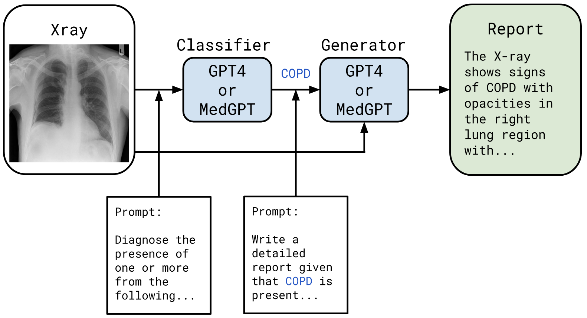
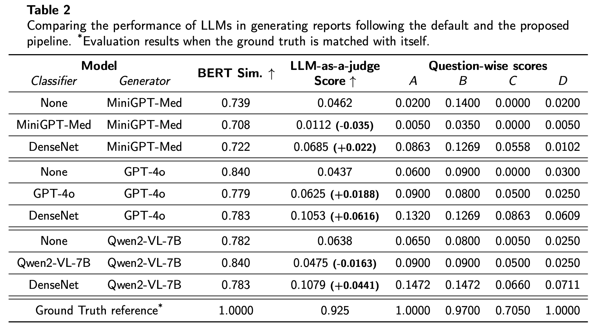

# DETerGENt
---


Exploring the Missing Medical Context in Generated Radiology Reports, accepted to [SLM4Health](https://slm4health2025.netlify.app/) @ [AIME-2025](https://aime25.aimedicine.info/).

[](https://ceur-ws.org/Vol-3985/paper4.pdf)

To make our research reproducible, we provide all the code used and also instructions on how to reproduce.

## Basic environment setup
---
You can install the dependencies with these commands (We have used python 3.9.19)
```bash
pip install -r requirements.txt
```
OR if you use conda, then first run
```bash
conda create -n detergent python=3.9.19
```
We have however, used Google CoLab for all of the experiments.

## Data
---
Our collected dataset of 200 radiology reports is placed in the `data/` folder.

## Language Models
---
The code for language models is in `src/lang.py`, we only use LLMs fro prediction and explanation, so we have quite structured prompts, this is the file where you might want to add your own LLM. Basically, you would need to create a client which can take the prompt / context as input (anything else is optional and dependent on the actual model).

### MiniGPT4 / non-HuggingFace open-source model
In order to perform the MiniGPT-Med experiments, we clone the original repo and use it with slight modifications. This is already cloned inside `minigpt4/`. Any other analogous non-HuggingFace open-source model can be added similar to this. This specific model doesn't need a lot fo VRAM.

### GPT experiments / API-based closed-source models
These will require you to set two environment variables `OPENAI_ORG`, `OPENAI_KEY`. Claude, DeepSeek, etc. can be added like this. These are the only class of models which can be run on a CPU, other 2 require a GPU.

### Qwen-V2-7B experiments / HuggingFace open-source model
This model is similar to MiniGPT4, but on HuggingFace, and because it is 7B, it needs a lot of VRAM (~32GB).

## DenseNet
---
We also finetune a DenseNet on this dataset taking the backbone from [torchxrayvision](https://github.com/torchxrayvision). Note that this is done in a 5-fold manner, so the model's test set is different from it's train set, and there is no data leak.

## Running the experiments
---

### Training and evaluating the Discriminator
This can be done with
```bash
python3 src/vis/trainer.py
```
This will train the model in a 5-fold fashion and evaluate on the remaining set everytime, and save these predictions as well.

### With Language models
All experiments use `main.py`, with a specific config.
```bash
python3 main.py --path /path/to/config.yaml
```

1. We first perform two experiments in one run, by having a structure like this:
```yaml
exp_name: <exp_name>
evaluate: false
pred:
    model: <your_model>
    generate: true
    from_file: false
    path: None
    out_path: /path/to/out_preds.csv

expl:
    model: <your_model>
    generate: true
    from_file: false
    out_path: /path/to/out_expls.csv
    no_ctxt: true
```
This will perform the prediction task for `<your_model>` & also generate explanations without any context.

2. Then, to see how some predictions can help the explaining model, a structure like this is used:
```yaml
exp_name: <exp_name>_w_ctxt # this is just an example
evaluate: false
pred:
    model: <your_model>
    generate: false
    from_file: true
    path: /path/to/out_preds.csv
    out_path: None

expl:
    model: <your_model>
    generate: true
    from_file: false
    out_path: /path/to/out_expls_w_context.csv
    no_ctxt: false
```
Note that, you can also supply a path to predictions from any model, not just the same one.

3. Exactly as the above note, we pass discriminator's predictions to see if they help the model with a config like this:
```yaml
exp_name: disc_<your_model> # again, just an example
evaluate: false
pred:
    model: <your_model>
    generate: false
    from_file: true
    path: discriminator.csv # we have placed our discriminator's predictions in this file in the root folder
    out_path: None

expl:
    model: <your_model>
    generate: true
    from_file: false
    out_path: /path/to/out_expls_w_disc.csv
    no_ctxt: false
```
Note that this experiment assumes you have run the densenet model script.

### Evaluations
We provide an `evaluation.py` which has two functions, `evaluate_preds` and `evaluate_expls`, we have also kept the code we ran for our evaluations intact, basically, it needs ground truth explanations and predictions (`data/xray_data.csv`) and the explanations and predictions to be evaluated, then the evaluation can be run as a `df.apply()` operation. These results are printed on to the terminal. 

## Results
---



## Citation
---
Please create an issue if you need some functionality or the code doesn't work as intended. Thank you!
```bibtex
@inproceedings{KB:DETerGENt,
  title = {Exploring the Missing Medical Context in Generated Radiology Reports},
  author = {Karan Bania, Harshvardhan Mestha and Tanmay Tulsidas Verlekar},
  url = {https://ceur-ws.org/Vol-3985/paper4.pdf},
  crossref = {SLM4Health2025},
}
@proceedings{SLM4Health2025,
  booktitle = {SLM4Health - Improving Healthcare with Small Language Models},
  year = 2025,
  editor = {Kerstin Denecke, Douglas Teodoro, Daniel Reichenpfader, Yihan
  Deng and Edward Choi},
  number = 3985,
  series = {CEUR Workshop Proceedings},
  address = {Aachen},
  issn = {1613-0073},
  url = {https://ceur-ws.org/Vol-3985/},
  venue = {Pavia, Italu},
  eventdate = {2025-06-26},
  title = {Proceedings of the Workshop on SLM4Health - Improving Healthcare with Small Language Models}
}
```
